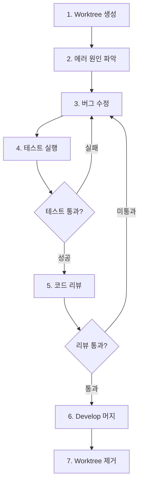

# Workflow: Bug Fix (Git Worktree)

## 개요

Git Worktree를 활용하여 버그를 안전하고 독립적으로 수정하는 워크플로우.

**핵심 개념**: 각 버그를 격리된 worktree에서 수정하여 메인 작업 공간과 분리

---

## 📋 전체 프로세스



---

## 1️⃣ Worktree 생성

> **버그 수정을 위한 격리된 작업 공간 생성**

### 브랜치 명명 규칙

```
fix/[이슈번호]-[간단한-설명]

예시:
fix/123-login-password-bug
fix/456-api-timeout-error
fix/789-null-pointer-exception
```

### Worktree 생성

```bash
# 1. develop 브랜치 최신화
git checkout develop
git pull origin develop

# 2. Worktree와 브랜치 동시 생성
git worktree add -b fix/123-login-bug ../worktrees/fix-123 develop

# 3. 생성된 worktree로 이동
cd ../worktrees/fix-123
```

---

## 2️⃣ 에러 원인 파악 및 분석

> **버그를 정확히 이해하고 근본 원인 찾기**

### 1. 버그 재현

**재현 조건 파악**:
- [ ] 어떤 환경에서 발생하나? (Production/Staging/Development)
- [ ] 특정 데이터/사용자에게만 발생하나?
- [ ] 일관되게 재현 가능한가?
- [ ] 영향 범위는? (전체/일부 기능)

**재현 정보 기록** (`docs/bugs/bug-123.md`):
```markdown
# Bug #123: 로그인 비밀번호 에러

## 환경
- 서버: Production
- 브라우저: Chrome 120
- 계정: 특수문자 포함 비밀번호

## 재현 단계
1. 특수문자가 포함된 비밀번호로 회원가입
2. 로그아웃
3. 동일한 비밀번호로 로그인 시도

## 예상 결과
로그인 성공

## 실제 결과
"Invalid password" 에러 발생

## 에러 로그
\`\`\`
Error: Password comparison failed
at UserService.validatePassword (user.service.ts:45)
\`\`\`
```

### 2. 원인 분석

**로그 확인**:
```bash
# 로컬 로그
tail -f logs/error.log

# 프로덕션 로그 (CloudWatch/DataDog/Sentry 등)
```

**관련 코드 검색**:
```bash
# 에러 메시지 키워드로 검색
grep -r "Invalid password" src/

# 관련 파일 찾기
find src/ -name "*user*" -o -name "*auth*"
```

**최근 변경 확인**:
```bash
# 해당 파일의 최근 변경 이력
git log --oneline -10 -- src/modules/user/user.service.ts

# 특정 커밋 이후 변경사항
git diff abc123..HEAD -- src/modules/user/

# 누가 수정했는지
git blame src/modules/user/user.service.ts
```

**원인 유형 분류**:
- **로직 오류**: 잘못된 조건문, 계산 오류
- **타입 불일치**: string vs number, null/undefined 처리
- **예외 처리 누락**: try-catch 없음, 에러 전파 실패
- **동시성 이슈**: Race condition, 데드락
- **환경 설정**: 잘못된 환경변수, 설정 파일
- **외부 서비스**: API 타임아웃, DB 연결 실패

---

## 3️⃣ 버그 수정

> **최소한의 변경으로 근본 원인 해결**

### 수정 원칙

1. **최소한의 변경**: 버그 수정에 필요한 것만
2. **리팩토링 분리**: 구조 개선은 별도 작업으로
3. **방어적 코딩**: 같은 유형 재발 방지
4. **테스트 추가**: 재현 테스트 필수

### 수정 예시

```typescript
// ❌ Before: 특수문자 처리 안 됨
async validatePassword(plainPassword: string, hashedPassword: string) {
  return plainPassword === hashedPassword;  // 평문 비교 (잘못됨)
}

// ✅ After: bcrypt로 암호화 비교
async validatePassword(plainPassword: string, hashedPassword: string) {
  return await bcrypt.compare(plainPassword, hashedPassword);
}
```

### 테스트 추가

**재현 테스트** (수정 전 실패, 후 성공):
```typescript
describe('Bug #123: Login with special characters password', () => {
  it('should handle special characters in password', async () => {
    const password = 'pass@#$%word!';
    
    // 회원가입
    await service.register({
      email: 'test@example.com',
      password,
    });
    
    // 로그인 (버그 재현)
    const result = await service.login({
      email: 'test@example.com',
      password,
    });
    
    expect(result).toBeDefined();
    expect(result.accessToken).toBeDefined();
  });
});
```

**Regression 테스트** (관련 기능):
```typescript
describe('User Login', () => {
  it('should handle normal password', async () => {
    // 기존 기능 정상 동작 확인
  });
  
  it('should handle long password', async () => {
    // 다른 엣지 케이스 테스트
  });
});
```

> 💡 **테스트 작성에 도움이 필요하다면**  
> `backend-testing` 스킬을 사용하세요. Jest, Prisma 모킹, AAA 패턴 등 테스트 작성 베스트 프랙티스를 제공합니다.

---

## 4️⃣ 테스트 실행

### Unit 테스트

```bash
# 전체 테스트
npm run test

# 특정 파일만
npm run test -- user.service.spec.ts

# Watch 모드
npm run test -- --watch
```

### E2E 테스트

```bash
# E2E 테스트
npm run test:e2e

# 특정 테스트만
npm run test:e2e -- user.e2e-spec.ts
```

### 버그 재현 테스트

```bash
# 로컬 서버 실행
npm run start:dev

# 재현 단계 수동 실행
# 1. 특수문자 포함 비밀번호로 회원가입
# 2. 로그아웃
# 3. 로그인 시도
# → 성공 확인 ✅
```

### ❌ 테스트 실패 시

→ **3️⃣ 버그 수정**으로 돌아가서 수정

---

## 5️⃣ 코드 리뷰 (AI 자동 리뷰)

> **AI 에이전트가 `code-review` 스킬을 사용하여 자동으로 코드 리뷰 수행**
> **커밋 전에 리뷰하여 깔끔한 커밋 히스토리 유지**

### 1. 변경사항 스테이징

```bash
# 스테이징
git add .
```

### 2. AI 코드 리뷰 실행

AI 에이전트에게 code-review 스킬을 사용하여 리뷰 요청:

```
git diff --staged 결과를 code-review 스킬로 리뷰해줘
```

> AI 에이전트가 자동으로:
> 1. `git diff` 명령 실행
> 2. 결과를 code-review 스킬에 전달
> 3. 리뷰 수행 및 리포트 생성

### 3. 리뷰 리포트 확인

```bash
# 리포트 위치: docs/code-review/code-review-{timestamp}.md
ls -lah docs/code-review/

# 가장 최근 리뷰 리포트 확인
cat $(ls -t docs/code-review/code-review-*.md | head -1)
```

### 4. 리뷰 결과에 따른 조치

#### ✅ 리뷰 통과 (문제 없음)

```bash
# 커밋
git commit -m "fix(user): handle special characters in password

- Add bcrypt password comparison
- Add validation for special characters
- Add regression test for bug #123

Fixes #123"
```

→ **6️⃣ Develop 머지**로 진행

#### ⚠️ 발견 사항 있음 (수정 필요)

**Critical/High 심각도**:
```bash
# 스테이징 취소
git reset

# 3단계(버그 수정)로 복귀하여 문제 수정
```

**Medium/Low 심각도**:
```bash
# 수정 권장 - 판단 후 진행
# 1. 수정하고 다시 리뷰 또는
# 2. 이슈로 등록 후 진행
```

---

## 6️⃣ Develop 브랜치 머지 및 푸시

> **AI 리뷰 통과 후 로컬에서 develop에 머지하고 원격에 푸시**

### 1. 메인 프로젝트의 develop으로 복귀

```bash
# Worktree에서 메인 프로젝트로 이동
cd ../../main-project

# develop 브랜치로 체크아웃
git checkout develop

# 최신 상태로 업데이트
git pull origin develop
```

### 2. Fix 브랜치 머지

```bash
# Fix 브랜치를 develop에 머지
git merge fix/123-login-bug

# 또는 squash merge (권장)
git merge --squash fix/123-login-bug
git commit -m "fix(user): handle special characters in password

- Add bcrypt password comparison
- Add validation for special characters  
- Add regression test for bug #123
- AI code review passed

Fixes #123"
```

### 3. Develop 푸시

```bash
# 원격 develop에 푸시
git push origin develop
```

### 4. 브랜치 정리

```bash
# 로컬 fix 브랜치 삭제
git branch -d fix/123-login-bug
```

---

## 7️⃣ Worktree 제거

### 안전한 Worktree 제거

```bash
# 1. 메인 프로젝트로 이동 (이미 6단계에서 이동함)
cd /path/to/main-project

# 2. Worktree 제거
git worktree remove ../worktrees/fix-123

# 3. Worktree 목록 확인
git worktree list
```

### Worktree 강제 제거

```bash
# 변경사항이 있어도 강제 제거 (주의!)
git worktree remove --force ../worktrees/fix-123
```

---

## 🔧 유용한 팁

### 버그 재현 팁

**재현 환경 구축**:
```bash
# Production 환경 복사
cp .env.production .env.local

# 특정 시점의 DB 스냅샷 사용
# (Docker, AWS RDS Snapshot 등)

# 실제 사용자 데이터 익명화하여 테스트
```

**재현 스크립트 작성**:
```bash
# scripts/reproduce-bug-123.sh
#!/bin/bash
curl -X POST localhost:3000/auth/register -d '{"email":"test@example.com","password":"pass@#$%!"}'
curl -X POST localhost:3000/auth/login -d '{"email":"test@example.com","password":"pass@#$%!"}'
```

### 디버깅 팁

**로거 추가**:
```typescript
this.logger.debug('Password validation started', { 
  email, 
  passwordLength: plainPassword.length 
});
```

**Debugger 사용**:
```typescript
// VSCode debugger breakpoint
debugger;

// 또는 조건부 breakpoint
if (email === 'test@example.com') {
  debugger;
}
```

**환경별 로그 레벨**:
```bash
# Development: DEBUG
LOG_LEVEL=debug npm run start:dev

# Production: ERROR only
LOG_LEVEL=error npm run start:prod
```

### Git Bisect (원인 커밋 찾기)

```bash
# 버그가 없던 시점과 버그가 있는 시점 사이에서 이분 탐색
git bisect start
git bisect bad HEAD
git bisect good v1.2.0

# 각 커밋에서 테스트 실행하여 good/bad 판정
npm run test
git bisect good  # 또는 bad

# 원인 커밋 찾으면 종료
git bisect reset
```

---

## ⚠️ 주의사항

### 1. 최소한의 변경

버그 수정에 **필요한 것만** 변경:
```typescript
// ❌ 나쁜 예: 버그 수정과 함께 리팩토링
fix(user): handle special characters + refactor user service

// ✅ 좋은 예: 버그 수정만
fix(user): handle special characters in password
```

### 2. 사이드 이펙트 확인

수정이 다른 곳에 영향을 주지 않는지 확인:
```bash
# 관련 테스트 모두 실행
npm run test

# 영향받을 수 있는 API 수동 테스트
```

### 3. 재발 방지

같은 패턴이 다른 곳에도 있는지 확인:
```bash
# 비슷한 패턴 검색
grep -r "plainPassword ===" src/

# 발견 시 함께 수정하거나 별도 이슈 생성
```

### 4. 문서 업데이트

필요한 경우 문서 업데이트:
- API 스펙 변경 시 `docs/guides/` 업데이트
- 새로운 환경변수 추가 시 `.env.example` 업데이트
- 설정 변경 시 `README.md` 업데이트

---

## 체크리스트

### 수정 전
- [ ] 버그 재현 가능
- [ ] 원인 파악 완료
- [ ] 영향 범위 확인

### 수정 후
- [ ] 버그 해결 확인
- [ ] 재현 테스트 추가
- [ ] 전체 테스트 통과
- [ ] AI 코드 리뷰 통과
- [ ] 다른 기능 영향 없음
