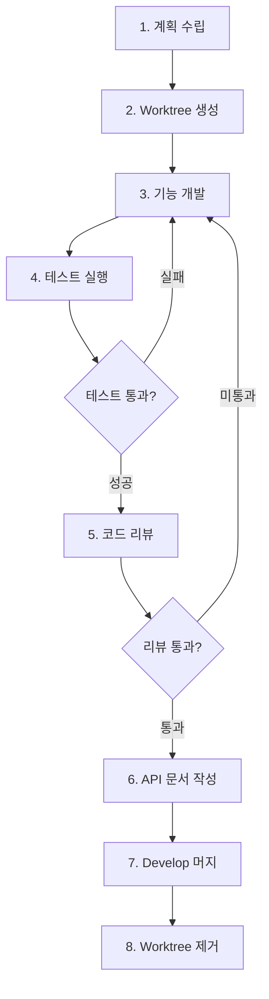

# Workflow: Feature Development (Git Worktree)

## 개요

Git Worktree를 활용하여 신규 기능을 안전하고 독립적으로 개발하는 워크플로우.

**핵심 개념**: 각 기능을 격리된 worktree에서 개발하여 메인 작업 공간과 분리

---

## 📋 전체 프로세스



---

## 1️⃣ 신규 기능 계획 수립

### 요구사항 분석

**체크리스트**:
- [ ] 요구사항이 명확한가?
- [ ] 영향 범위 파악 (기존 코드, DB 스키마 등)
- [ ] 예외 케이스 정의
- [ ] 필요한 API 엔드포인트 목록화

### 기능 명세 작성

```markdown
## 기능: [기능명]

### 요구사항
- 요구사항 1
- 요구사항 2

### 구현 범위
- [ ] Entity/DTO 설계
- [ ] Service 로직 구현
- [ ] Controller API 구현
- [ ] 테스트 작성

### 예외 케이스
- 케이스 1: 처리 방법
- 케이스 2: 처리 방법
```

**출력**: `docs/features/[기능명].md` 또는 이슈 코멘트

---

## 2️⃣ Worktree 생성

### 기본 Worktree 생성

```bash
# 1. develop 브랜치 최신화
git checkout develop
git pull origin develop

# 2. Worktree와 브랜치 동시 생성
git worktree add -b feature/123-user-profile ../worktrees/feature-123 develop
#                ↑ 새 브랜치 생성           ↑ worktree 경로       ↑ develop에서 시작

# 3. 생성된 worktree로 이동
cd ../worktrees/feature-123
```

**명령어 설명**:
- `-b feature/123-user-profile`: 생성할 브랜치 이름
- `../worktrees/feature-123`: worktree가 저장될 디렉토리 경로 (브랜치명과 다를 수 있음)
- `develop`: 시작 브랜치 (develop의 최신 커밋에서 새 브랜치 생성)

> **참고**: 브랜치명은 슬래시(`/`) 사용, 디렉토리명은 하이픈(`-`) 사용이 일반적

### Worktree 명명 규칙

```
../worktrees/
├── feature-123-user-profile/
├── feature-124-payment-system/
└── hotfix-125-auth-bug/
```

**패턴**: `feature-{issue-number}-{description}` 또는 `hotfix-{number}-{description}`

### Worktree 확인

```bash
# 현재 생성된 worktree 목록 확인
git worktree list

# 출력 예시:
# /path/to/main-project      abc1234 [develop]
# /path/to/worktrees/feature  def5678 [feature/123-user-profile]
```

---

## 3️⃣ 기능 개발

> **참고**: 이제부터 모든 작업은 worktree 디렉토리 내에서 진행

### 구현 순서

1. **Entity/DTO 생성**
   ```bash
   # 예시: NestJS 프로젝트
   src/modules/user/dto/create-user.dto.ts
   src/modules/user/entities/user.entity.ts
   ```

2. **Service 비즈니스 로직**
   ```typescript
   // src/modules/user/user.service.ts
   @Injectable()
   export class UserService {
     async createUser(dto: CreateUserDto): Promise<User> {
       // 비즈니스 로직
     }
   }
   ```

3. **Controller API 엔드포인트**
   ```typescript
   @Controller('users')
   export class UserController {
     @Post()
     async create(@Body() dto: CreateUserDto) {
       return this.userService.createUser(dto);
     }
   }
   ```

4. **Module 등록**

### DB 마이그레이션 (필요시)

```bash
# Prisma 사용 예시
npx prisma migrate dev --name add_user_profile

# 마이그레이션 확인
npx prisma migrate status
```

### 코드 품질 체크

```bash
# Lint 실행
npm run lint

# Type 체크
npm run type-check
```

**체크리스트**:
- [ ] TypeScript strict 모드 에러 없음
- [ ] ESLint 경고 없음
- [ ] 적절한 에러 처리
- [ ] 로깅 추가 (중요 작업)

---

## 4️⃣ 테스트 실행

### Unit 테스트

```bash
# 전체 테스트 실행
npm run test

# 특정 서비스만 테스트 (Watch 모드)
npm run test -- --watch user.service

# 특정 테스트 케이스만
npm run test -- --testNamePattern="should create user"
```

### 통합 테스트

```bash
# E2E 테스트
npm run test:e2e

# 특정 API 테스트
npm run test:e2e -- user.e2e-spec
```

### 테스트 커버리지

```bash
# 커버리지 리포트 생성
npm run test:cov

# 80% 이상 목표
```

**최소 테스트 범위**:
- [ ] 정상 케이스 (Happy path)
- [ ] 유효성 검증 실패 (400)
- [ ] 리소스 없음 (404)
- [ ] 권한 없음 (403)
- [ ] 중복/충돌 (409)

> 💡 **테스트 작성에 도움이 필요하다면**  
> `backend-testing` 스킬을 사용하세요. Jest, Prisma 모킹, AAA 패턴 등 테스트 작성 베스트 프랙티스를 제공합니다.

### ❌ 테스트 실패 시

→ **3️⃣ 기능 개발**로 돌아가서 수정

---

## 5️⃣ 코드 리뷰 (AI 자동 리뷰)

> **AI 에이전트가 `code-review` 스킬을 사용하여 자동으로 코드 리뷰 수행**
> **커밋 전에 리뷰하여 깔끔한 커밋 히스토리 유지**

### 1. 변경사항 스테이징

```bash
# 변경사항 확인
git status

# 스테이징
git add .
```

### 2. AI 코드 리뷰 실행

AI 에이전트에게 code-review 스킬을 사용하여 리뷰 요청:

```
git diff --staged 결과를 code-review 스킬로 리뷰해줘
```

또는 develop 브랜치와 비교하려면:

```
git diff develop 결과를 code-review 스킬로 리뷰해줘
```

> AI 에이전트가 자동으로:
> 1. `git diff` 명령 실행
> 2. 결과를 code-review 스킬에 전달
> 3. 리뷰 수행 및 리포트 생성

### 3. 리뷰 리포트 확인

AI 에이전트가 생성한 리뷰 리포트 확인:

```bash
# 리포트 위치: docs/code-review/code-review-{timestamp}.md
ls -lah docs/code-review/

# 가장 최근 리뷰 리포트 확인
cat $(ls -t docs/code-review/code-review-*.md | head -1)
```

**리뷰 리포트 구성**:
- **요약 테이블**: 보안, 코드 품질, 성능, LLM 코드 스멜, 영향도 분석 등
- **상세 발견 사항**: 각 문제의 파일, 라인, 코드 스니펫, 권장 사항
- **경영진 요약**: 중요 문제, 높은 우선순위 문제, 전반적인 권장 사항

### 4. 리뷰 결과에 따른 조치

#### ✅ 리뷰 통과 (문제 없음)

```bash
# 커밋
git commit -m "feat(user): add user profile feature

- Add profile DTO and entity
- Implement profile CRUD in service
- Add API endpoints for profile management
- Add unit tests with 85% coverage

Closes #123"
```

→ **6️⃣ API 문서 작성**으로 진행

#### ⚠️ 발견 사항 있음 (수정 필요)

리뷰 리포트의 심각도에 따라 조치:

**Critical/High 심각도**:
```bash
# 수정 필수 - 스테이징 취소 후 수정
git reset

# 3단계(기능 개발)로 복귀하여 문제 수정
# 수정 후 다시 4단계(테스트) → 5단계(리뷰) 실행
```

**Medium/Low 심각도**:
```bash
# 수정 권장 - 판단 후 진행
# 1. 수정하고 다시 리뷰 또는
# 2. 이슈로 등록 후 진행
```

### 5. 수정 후 재리뷰

```bash
# 스테이징 취소
git reset

# 문제 수정
# (코드 수정)

# 다시 스테이징
git add .
```

다시 AI 리뷰 요청 (2단계부터 반복):
```
git diff --staged 결과를 code-review 스킬로 리뷰해줘
```

### ❌ Critical 문제 발견 시

→ **3️⃣ 기능 개발**로 돌아가서 수정

---

## 6️⃣ API 문서 작성

> **코드 리뷰 통과 후 API 엔드포인트를 추가/변경한 경우 반드시 문서화**

### AI 자동 문서화

에이전트에게 `api-documentation` 스킬을 사용하여 자동으로 문서를 생성하도록 요청하세요.

```bash
# 명령어 예시
"api-documentation 스킬을 써서 user 모듈의 API 명세서를 작성해줘. 경로는 docs/guides/user-api.md로 해줘."
```

### 문서 경로

```bash
# API 명세서 작성 위치
docs/guides/[모듈명]-api.md

# 예시
docs/guides/user-profile-api.md
docs/guides/payment-api.md
```

### 문서화 대상

- **Request**: Path/Query 파라미터, Body 필드 (타입, 필수/선택, 제약조건)
- **Response**: 성공 응답 구조, 예시 데이터
- **Error**: 발생 가능한 에러 코드 및 케이스
- **Example**: cURL 또는 실제 요청 예시

> 💡 **Tip**: `api-documentation` 스킬은 코드(DTO, Controller)를 분석하여 위 내용을 자동으로 추출하고 표준 포맷으로 작성해줍니다.

---


### 문서 작성 체크리스트

- [ ] 모든 새로운/변경된 엔드포인트 문서화
- [ ] Request/Response 예시 포함
- [ ] 에러 코드 정의
- [ ] 인증/권한 요구사항 명시
- [ ] Path/Query/Body 파라미터 설명

### 📋 참고사항

> **주의**: API 문서는 `.gitignore`에 포함되어 있어 Git에 커밋되지 않습니다.
> - 로컬 개발 환경에서만 참조 가능
- 팀원과 공유가 필요한 경우 별도의 문서 관리 시스템 사용 (Notion, Confluence 등)

---

## 7️⃣ Develop 브랜치 머지 및 푸시

> **AI 리뷰 통과 후 로컬에서 develop에 머지하고 원격에 푸시**

### 1. 메인 프로젝트의 develop으로 복귀

```bash
# Worktree에서 메인 프로젝트로 이동
cd ../../main-project  # 또는 절대 경로 사용

# develop 브랜치로 체크아웃
git checkout develop

# 최신 상태로 업데이트
git pull origin develop
```

### 2. Feature 브랜치 머지

**옵션 1: 일반 Merge (히스토리 유지)**
```bash
# 모든 커밋 히스토리 유지
git merge feature/123-user-profile
```
- ✅ 모든 세부 커밋 접근 가능
- ✅ 큰 기능이나 장기 작업에 적합
- ❌ develop 히스토리가 복잡해질 수 있음

**옵션 2: Squash Merge (히스토리 압축)**
```bash
# 여러 커밋을 하나로 압축
git merge --squash feature/123-user-profile
git commit -m "feat(user): add user profile feature

- Add profile DTO and entity
- Implement profile CRUD in service
- Add API endpoints for profile management
- Add unit tests with 85% coverage
- AI code review passed (security, performance, quality)

Closes #123"
```
- ✅ 깔끔한 develop 히스토리
- ✅ 작은~중간 크기 기능에 적합
- ❌ 세부 커밋 히스토리는 feature 브랜치에만 남음

**선택 가이드**:
- **Squash 권장**: 일반적인 기능 개발 (1주일 이하)
- **일반 Merge 권장**: 큰 기능 (여러 주), 각 커밋이 중요한 마일스톤일 때

### 3. Develop 푸시

```bash
# 원격 develop에 푸시
git push origin develop
```

### 4. 브랜치 정리

```bash
# 로컬 feature 브랜치 삭제
git branch -d feature/123-user-profile

# 원격 브랜치가 있다면 삭제 (선택사항)
git push origin --delete feature/123-user-profile
```

### 대안: PR 워크플로우 (팀 프로젝트용)

팀 리뷰가 필요한 경우:

```bash
# 1. Feature 브랜치를 원격에 푸시
git push origin feature/123-user-profile

# 2. GitHub/GitLab/Bitbucket에서 PR 생성
# 3. 팀원 리뷰 후 Web UI에서 머지
# 4. 로컬 develop 업데이트
git checkout develop
git pull origin develop

# 5. 브랜치 정리
git branch -d feature/123-user-profile
```


---

## 8️⃣ Worktree 제거

### 안전한 Worktree 제거

```bash
# 1. 메인 프로젝트로 돌아가기
cd /path/to/main-project

# 2. Worktree 제거
git worktree remove ../worktrees/feature-123-user-profile

# 또는 디렉토리 삭제 후 정리
rm -rf ../worktrees/feature-123-user-profile
git worktree prune
```

### 브랜치 정리

```bash
# 로컬 브랜치 삭제
git branch -d feature/123-user-profile

# 원격 브랜치 삭제 (옵션)
git push origin --delete feature/123-user-profile
```

### Worktree 상태 확인

```bash
# 남아있는 worktree 확인
git worktree list

# 불필요한 worktree 정보 정리
git worktree prune
```

---

## 🔧 유용한 팁

### 여러 기능 동시 개발

```bash
# Feature A 개발
git worktree add ../worktrees/feature-a feature/100-feature-a

# Feature B 개발 (동시에 가능)
git worktree add ../worktrees/feature-b feature/101-feature-b

# 각 디렉토리에서 독립적으로 작업
```

### Worktree 간 이동

```bash
# 현재 worktree 목록
git worktree list

# 다른 worktree로 이동
cd ../worktrees/feature-b
```

### Stash 활용

```bash
# Worktree A에서 작업 중단
git stash save "WIP: feature A progress"

# Worktree B로 이동 후 작업
cd ../worktrees/feature-b

# 다시 Worktree A로 돌아와서 재개
cd ../worktrees/feature-a
git stash pop
```

### Worktree에서 공통 설정 공유

Worktree는 `.git/config`를 공유하므로 다음 설정은 모든 worktree에 적용됩니다:
- Git 사용자 정보
- 원격 저장소 설정
- Git hooks (`.git/hooks`)

---

## ⚠️ 주의사항

### 1. Node Modules 관리

각 worktree는 독립적인 `node_modules`를 가지므로:

```bash
# 각 worktree에서 패키지 설치 필요
cd ../worktrees/feature-123
npm install

# 또는 심볼릭 링크 활용 (권장하지 않음)
```

### 2. 환경 변수 파일

`.env` 파일은 각 worktree에 복사 필요:

```bash
cp /path/to/main-project/.env ../worktrees/feature-123/.env
```

### 3. Worktree 삭제 전 확인

```bash
# 커밋되지 않은 변경사항 확인
git status

# Stash 또는 커밋 후 삭제
```

---

## 📚 빠른 참조

```bash
# === Worktree 생성 ===
git checkout develop && git pull
git worktree add -b feature/xxx-description ../worktrees/feature-xxx develop
cd ../worktrees/feature-xxx

# === 개발 ===
# (코드 작성)
npm run lint
npm run test

# === AI 코드 리뷰 ===
git add .
# AI 에이전트에게: "git diff --staged 결과를 code-review 스킬로 리뷰해줘"
git commit -m "feat: ..."

# === Develop 머지 및 푸시 ===
cd ../../main-project
git checkout develop && git pull
git merge --squash feature/xxx-description
git commit -m "feat: ..."
git push origin develop

# === 정리 ===
git branch -d feature/xxx-description
git worktree remove ../worktrees/feature-xxx
```

---

## 🔗 관련 문서

- [Git Worktree 공식 문서](https://git-scm.com/docs/git-worktree)
- `bug-fix.md` - 버그 수정 워크플로우
- `pr-review.md` - 코드 리뷰 가이드
