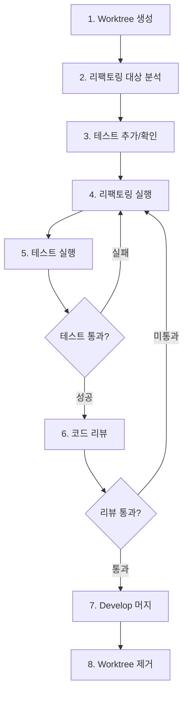

# Workflow: Refactoring (Git Worktree)

## 개요

Git Worktree를 활용하여 코드를 안전하고 독립적으로 리팩토링하는 워크플로우.

**핵심 원칙**: 기능 변경 없이 구조만 개선

**핵심 개념**: 각 리팩토링을 격리된 worktree에서 수행하여 메인 작업 공간과 분리

---

## 📋 전체 프로세스



---

## 리팩토링 유형

| 유형 | 설명 | 위험도 |
|------|------|--------|
| 네이밍 개선 | 변수/함수명 명확화 | 🟢 낮음 |
| 함수 추출 | 긴 함수를 작은 단위로 분리 | 🟢 낮음 |
| 중복 제거 | 반복 코드 통합 | 🟡 중간 |
| 구조 변경 | 모듈/클래스 재구성 | 🟠 높음 |
| 타입 강화 | any → 구체적 타입 | 🟡 중간 |
| 의존성 정리 | 순환 참조 제거 등 | 🟠 높음 |

---

## 1️⃣ Worktree 생성

> **리팩토링을 위한 격리된 작업 공간 생성**

### 브랜치 명명 규칙

```
refactor/[모듈명]-[개선내용]

예시:
refactor/user-service-extract-methods
refactor/order-remove-duplicates
refactor/auth-strengthen-types
```

### Worktree 생성

```bash
# 1. develop 브랜치 최신화
git checkout develop
git pull origin develop

# 2. Worktree와 브랜치 동시 생성
git worktree add -b refactor/user-service-extract ../worktrees/refactor-user develop

# 3. 생성된 worktree로 이동
cd ../worktrees/refactor-user
```

---

## 2️⃣ 리팩토링 대상 분석

> **개선이 필요한 코드 식별 및 분석**

### Code Smells (냄새 나는 코드)

**체크리스트**:
- [ ] 긴 함수 (30줄+)
- [ ] 거대한 클래스
- [ ] 중복 코드
- [ ] 긴 매개변수 목록
- [ ] 복잡한 조건문
- [ ] any 타입 남용
- [ ] 순환 참조
- [ ] 미사용 코드

### 측정 도구

```bash
# 코드 복잡도 체크
npx ts-complexity ./src

# 미사용 export 찾기
npx ts-prune ./src

# 순환 참조 체크
npx madge --circular ./src

# 파일 크기별 정렬
find src -name "*.ts" -exec wc -l {} \; | sort -rn | head -20
```

### 리팩토링 계획 수립

```markdown
## 리팩토링 계획: User Service

### 대상
- `src/modules/user/user.service.ts` (350줄)

### 문제점
- `createUser` 메서드가 80줄로 너무 김
- 중복 코드: 이메일 검증 로직 3곳에서 반복
- any 타입 남용: `processUserData` 함수

### 개선 방안
1. 긴 함수 → 작은 메서드로 분리
2. 중복 검증 로직 → 공통 메서드 추출
3. any 타입 → 구체적 인터페이스 정의

### 예상 효과
- 가독성 개선
- 테스트 용이성 증가
- 유지보수성 향상
```

---

## 3️⃣ 테스트 추가 및 확인

> **⚠️ 필수**: 리팩토링 전 테스트로 기존 동작 보호

### 현재 테스트 상태 확인

```bash
# 테스트 커버리지 확인
npm run test:cov

# 관련 모듈 테스트 실행
npm run test -- user.service.spec.ts
```

### 테스트 부족 시

**리팩토링 전에 테스트 먼저 추가**:

```typescript
// user.service.spec.ts
describe('UserService (Refactoring 전 보호)', () => {
  it('should create user with valid data', async () => {
    const dto = { email: 'test@example.com', name: 'Test' };
    const result = await service.create(dto);
    
    expect(result).toMatchObject(dto);
    expect(result.id).toBeDefined();
  });
  
  it('should reject duplicate email', async () => {
    const dto = { email: 'test@example.com', name: 'Test' };
    await service.create(dto);
    
    await expect(service.create(dto)).rejects.toThrow(ConflictException);
  });
});
```

> 💡 **테스트 작성에 도움이 필요하다면**  
> `backend-testing` 스킬을 사용하세요. Jest, Prisma 모킹, AAA 패턴 등 테스트 작성 베스트 프랙티스를 제공합니다.

### 테스트 통과 확인

```bash
# 모든 테스트 통과 확인
npm run test

# 실패하는 테스트가 있다면 먼저 수정
```

---

## 4️⃣ 리팩토링 실행

> **작은 단위로 점진적으로 개선**

### 원칙: 한 번에 하나씩

```markdown
❌ 나쁜 예:
- 함수 추출 + 네이밍 변경 + 타입 수정 (한 번에)

✅ 좋은 예:
- Step 1: 함수 추출
- Step 2: 네이밍 변경  
- Step 3: 타입 수정
```

### 리팩토링 패턴

#### 1. 긴 함수 → 함수 추출

```typescript
// Before: 긴 함수
async createUser(dto: CreateUserDto) {
  // 80줄의 코드...
  // 이메일 중복 확인
  // 비밀번호 해싱
  // 사용자 생성
  // 프로필 초기화
  // 환영 이메일 발송
}

// After: 의미 있는 단위로 분리
async createUser(dto: CreateUserDto) {
  await this.validateEmail(dto.email);
  const hashedPassword = await this.hashPassword(dto.password);
  const user = await this.saveUser({ ...dto, password: hashedPassword });
  await this.initializeProfile(user.id);
  await this.sendWelcomeEmail(user.email);
  return user;
}

private async validateEmail(email: string) { /* ... */ }
private async hashPassword(password: string) { /* ... */ }
private async saveUser(data: CreateUserData) { /* ... */ }
private async initializeProfile(userId: string) { /* ... */ }
private async sendWelcomeEmail(email: string) { /* ... */ }
```

#### 2. 복잡한 조건문 → 가드 클로즈

```typescript
// Before: 중첩된 조건문
async processRequest(user: User, request: Request) {
  if (user) {
    if (user.isActive) {
      if (request.isValid) {
        // 실제 로직
      } else {
        throw new BadRequestException();
      }
    } else {
      throw new ForbiddenException();
    }
  } else {
    throw new UnauthorizedException();
  }
}

// After: 가드 클로즈 패턴
async processRequest(user: User, request: Request) {
  if (!user) {
    throw new UnauthorizedException();
  }
  if (!user.isActive) {
    throw new ForbiddenException();
  }
  if (!request.isValid) {
    throw new BadRequestException();
  }
  
  // 실제 로직 (들여쓰기 없음)
}
```

#### 3. 중복 코드 → 공통 함수

```typescript
// Before: 중복 코드
class UserService {
  async create(dto: CreateUserDto) {
    const exists = await this.prisma.user.findUnique({ 
      where: { email: dto.email } 
    });
    if (exists) throw new ConflictException('Email exists');
    // ...
  }
  
  async update(id: number, dto: UpdateUserDto) {
    const exists = await this.prisma.user.findUnique({ 
      where: { email: dto.email } 
    });
    if (exists && exists.id !== id) {
      throw new ConflictException('Email exists');
    }
    // ...
  }
}

// After: 공통 메서드 추출
class UserService {
  async create(dto: CreateUserDto) {
    await this.ensureEmailNotExists(dto.email);
    // ...
  }
  
  async update(id: number, dto: UpdateUserDto) {
    await this.ensureEmailNotExists(dto.email, id);
    // ...
  }
  
  private async ensureEmailNotExists(email: string, excludeId?: number) {
    const exists = await this.prisma.user.findUnique({ where: { email } });
    if (exists && exists.id !== excludeId) {
      throw new ConflictException('Email already exists');
    }
  }
}
```

#### 4. any 타입 → 구체적 타입

```typescript
// Before: any 타입
function processData(data: any): any {
  return data.map((item: any) => item.value);
}

// After: 구체적 타입
interface DataItem {
  id: number;
  value: string;
}

function processData(data: DataItem[]): string[] {
  return data.map((item) => item.value);
}
```

---

## 5️⃣ 테스트 실행

> **매 변경 후 반드시 테스트하여 기능 정상 작동 확인**

### 매 리팩토링 후 테스트

```bash
# Watch 모드로 실시간 테스트
npm run test -- --watch user.service

# 특정 테스트만
npm run test -- --testNamePattern="createUser"
```

### 전체 테스트

```bash
# 전체 테스트 실행
npm run test

# 타입 체크
npx tsc --noEmit

# Lint 체크
npm run lint
```

### ❌ 테스트 실패 시

→ **4️⃣ 리팩토링 실행**으로 돌아가서 수정

> **중요**: 리팩토링은 **기능 변경이 없어야** 하므로, 테스트가 실패하면 리팩토링이 잘못된 것입니다.

---

## 6️⃣ 코드 리뷰 (AI 자동 리뷰)

> **AI 에이전트가 `code-review` 스킬을 사용하여 자동으로 코드 리뷰 수행**
> **커밋 전에 리뷰하여 깔끔한 커밋 히스토리 유지**

### 1. 변경사항 스테이징

```bash
# 변경사항 확인
git status

# 스테이징
git add .
```

### 2. AI 코드 리뷰 실행

AI 에이전트에게 code-review 스킬을 사용하여 리뷰 요청:

```
git diff --staged 결과를 code-review 스킬로 리뷰해줘
```

> AI 에이전트가 자동으로:
> 1. `git diff` 명령 실행
> 2. 결과를 code-review 스킬에 전달
> 3. 리뷰 수행 및 리포트 생성

### 3. 리뷰 리포트 확인

```bash
# 리포트 위치: docs/code-review/code-review-{timestamp}.md
ls -lah docs/code-review/

# 가장 최근 리뷰 리포트 확인
cat $(ls -t docs/code-review/code-review-*.md | head -1)
```

### 4. 리뷰 결과에 따른 조치

#### ✅ 리뷰 통과 (문제 없음)

```bash
# 커밋
git commit -m "refactor(user): extract methods from createUser

- Extract validateEmail method
- Extract hashPassword method
- Extract saveUser method
- Extract initializeProfile method
- Extract sendWelcomeEmail method

No functional changes"
```

→ **7️⃣ Develop 머지**로 진행

#### ⚠️ 발견 사항 있음 (수정 필요)

**Critical/High 심각도**:
```bash
# 스테이징 취소
git reset

# 4단계(리팩토링 실행)로 복귀하여 문제 수정
```

**Medium/Low 심각도**:
```bash
# 수정 권장 - 판단 후 진행
```

---

## 7️⃣ Develop 브랜치 머지 및 푸시

> **AI 리뷰 통과 후 로컬에서 develop에 머지하고 원격에 푸시**

### 1. 메인 프로젝트의 develop으로 복귀

```bash
# Worktree에서 메인 프로젝트로 이동
cd ../../main-project

# develop 브랜치로 체크아웃
git checkout develop

# 최신 상태로 업데이트
git pull origin develop
```

### 2. Refactor 브랜치 머지

**옵션 1: 일반 Merge (히스토리 유지)**
```bash
# 모든 커밋 히스토리 유지
git merge refactor/user-service-extract
```
- ✅ 모든 세부 커밋 접근 가능
- ✅ 단계별 리팩토링 과정 추적 가능
- ❌ develop 히스토리가 복잡해질 수 있음

**옵션 2: Squash Merge (히스토리 압축)**
```bash
# 여러 커밋을 하나로 압축
git merge --squash refactor/user-service-extract
git commit -m "refactor(user): improve UserService readability

- Extract methods from createUser (80 lines → 15 lines)
- Remove duplicate email validation logic
- Add strict types to processUserData
- AI code review passed (quality, maintainability)

No functional changes"
```
- ✅ 깔끔한 develop 히스토리
- ✅ 일반적인 리팩토링에 적합
- ❌ 세부 리팩토링 단계는 refactor 브랜치에만 남음

**선택 가이드**:
- **Squash 권장**: 일반적인 리팩토링
- **일반 Merge 권장**: 대규모 리팩토링, 각 단계가 중요한 마일스톤일 때

### 3. Develop 푸시

```bash
# 원격 develop에 푸시
git push origin develop
```

### 4. 브랜치 정리

```bash
# 로컬 refactor 브랜치 삭제
git branch -d refactor/user-service-extract
```

---

## 8️⃣ Worktree 제거

### 안전한 Worktree 제거

```bash
# 1. 메인 프로젝트로 이동 (이미 7단계에서 이동함)
cd /path/to/main-project

# 2. Worktree 제거
git worktree remove ../worktrees/refactor-user

# 3. Worktree 목록 확인
git worktree list
```

---

## ⚠️ 주의사항

### 1. 기능 변경과 분리

**절대 원칙**: 리팩토링 커밋에 기능 변경 섞지 않기

```bash
# ❌ 나쁜 예
git commit -m "refactor(user): improve service + add email verification"

# ✅ 좋은 예
git commit -m "refactor(user): extract methods from createUser

No functional changes"
```

### 2. 한 번에 하나씩

여러 리팩토링을 동시에 진행하지 말 것:

```bash
# ❌ 나쁜 예: 여러 모듈 동시 리팩토링
워크플로우 1: refactor/user-service
워크플로우 2: refactor/order-service
워크플로우 3: refactor/payment-service

# ✅ 좋은 예: 하나씩 완료
1. refactor/user-service 완료 → 머지
2. refactor/order-service 시작
```

### 3. 테스트 필수

테스트 없는 코드는 리팩토링하지 말 것:

```bash
# 테스트가 없다면
1. 먼저 테스트 추가 (별도 커밋)
2. 테스트 통과 확인
3. 리팩토링 시작
```

### 4. 점진적으로

큰 리팩토링은 여러 단계로 분할:

```markdown
## 큰 리팩토링 예시: User 모듈 전체 구조 개선

### Phase 1 (PR #1)
- UserService의 긴 메서드 분리

### Phase 2 (PR #2)
- UserController 리팩토링

### Phase 3 (PR #3)
- User DTO 타입 강화
```

---

## 🚫 리팩토링 하지 말아야 할 때

1. **마감 직전**: 버그 리스크 증가
2. **테스트 없는 레거시 코드**: 테스트 먼저 추가
3. **곧 삭제될 코드**: 시간 낭비
4. **동작 이해가 불완전할 때**: 먼저 분석

---

## 🔧 유용한 팁

### Before/After 비교

```bash
# 리팩토링 전 복잡도 측정
npx ts-complexity ./src/modules/user/user.service.ts > before.txt

# 리팩토링 후 복잡도 측정
npx ts-complexity ./src/modules/user/user.service.ts > after.txt

# 비교
diff before.txt after.txt
```

### 작은 커밋 유지

```bash
# 리팩토링 타입별로 커밋 분리
git commit -m "refactor(user): extract email validation"
git commit -m "refactor(user): extract password hashing"
git commit -m "refactor(user): extract user creation"
```

### IDE 리팩토링 도구 활용

```
VSCode:
- F2: Rename Symbol
- Ctrl+Shift+R: Refactor...
- Extract Method, Extract Variable 등
```

---

## 체크리스트

### 리팩토링 전
- [ ] Code Smells 식별 완료
- [ ] 테스트 커버리지 확인 (또는 테스트 추가)
- [ ] 리팩토링 계획 수립

### 리팩토링 후
- [ ] 모든 테스트 통과
- [ ] 타입 체크 통과
- [ ] AI 코드 리뷰 통과
- [ ] 기능 변경 없음 확인
- [ ] 커밋 메시지에 "No functional changes" 명시
